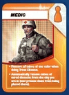
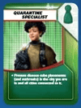

:orphan:

.. pandemic documentation master file, created by
   sphinx-quickstart on Wed Apr  2 20:52:49 2025.
   You can adapt this file completely to your liking, but it should at least
   contain the root `toctree` directive.

pandemic documentation
======================

Add your content using ``reStructuredText`` syntax. See the
`reStructuredText <https://www.sphinx-doc.org/en/master/usage/restructuredtext/index.html>`_
documentation for details.

.. toctree::
   :maxdepth: 2
   :caption: Contents:

   data_unloader
   world_map_drawer
   functions
   turn_handler
   modules

.. automodule:: data_unloader
   :members:
   :undoc-members:
   :show-inheritance:
   :no-index:

.. automodule:: world_map_drawer
   :members:
   :undoc-members:
   :show-inheritance:
   :no-index:

.. automodule:: functions
   :members:
   :undoc-members:
   :show-inheritance:
   :no-index:

.. automodule:: turn_handler
   :members:
   :undoc-members:
   :show-inheritance:
   :no-index:

